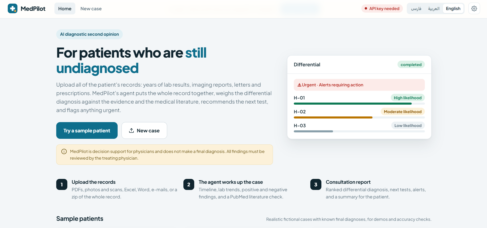
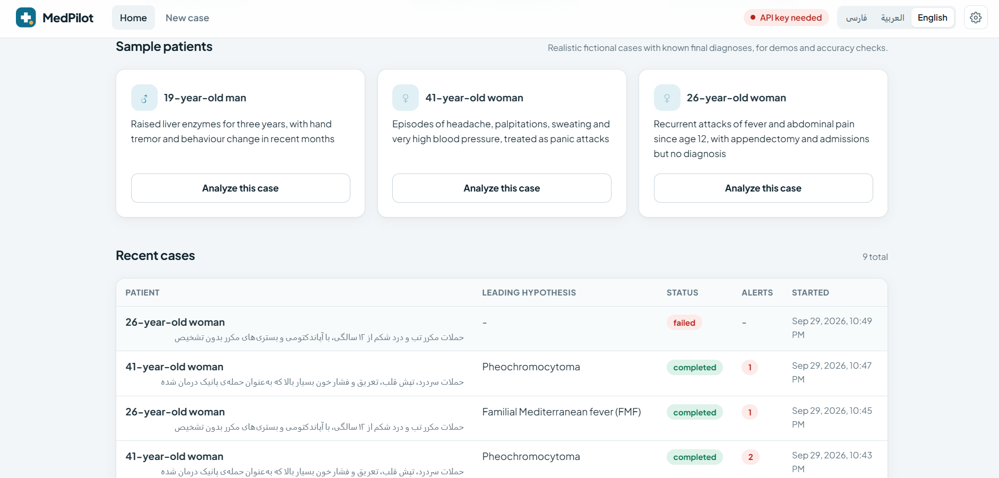
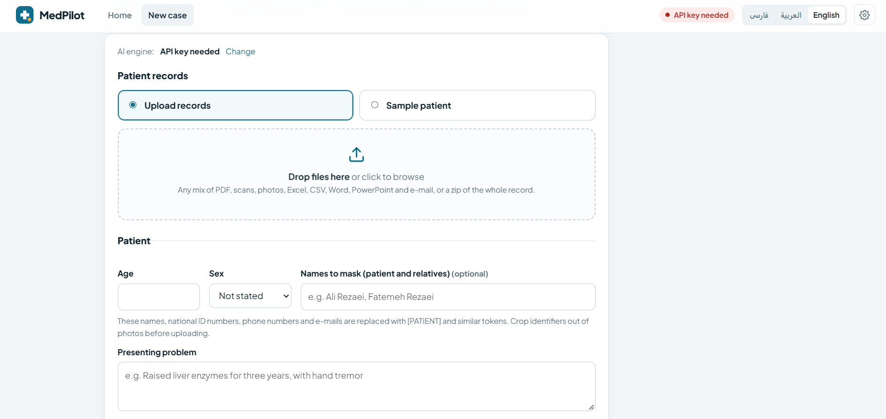

<div align="center">

# 🩺 MedPilot

### An AI diagnostic second opinion for patients who are still undiagnosed

**Decision support for physicians — every conclusion is verified by the treating doctor.**


</div>

---



## 💡 What it does

A physician uploads a patient's full record: years of lab results, imaging and pathology reports, clinic letters,
prescriptions, photos and scans. An AI agent reads the **whole** record and returns a consultation report:

- **Urgent alerts** — dangerous conditions, harmful drugs under a leading hypothesis, critical or worsening results
- **A ranked differential diagnosis** — for each hypothesis: the findings for and against it, what's missing, its likelihood, and **PubMed references**
- **Next tests** — the investigations that best separate the hypotheses, with how to read each result
- **Timeline, lab-trend charts and key findings**, including pertinent negatives
- **A consultation summary** for the physician and **a plain-language summary** for the patient

> ⚕️ MedPilot is **decision support**. It does not make a diagnosis, and every conclusion must be verified by the treating physician.



## 📊 Measured accuracy

The project ships with three fictional but realistic patients whose final diagnoses are known. The answer key lives in `tests/expected_cases.json` and is **never shown to the agent**. Result with `gpt-5.4-mini` in Economy mode:

| Case | Correct diagnosis ranked | Key test recommended | Expected alerts |
|---|---|---|---|
| **Wilson disease** | 1st | ✓ ceruloplasmin, urine copper, slit lamp | — |
| **Pheochromocytoma** (treated as panic disorder) | 1st | ✓ plasma metanephrines | ✓ beta-blocker / metoclopramide |
| **Familial Mediterranean fever** (with early amyloidosis) | 1st | ✓ MEFV genetics | ✓ AA amyloidosis |

Three cases are a demonstration, not a clinical validation.



## 🤖 How the agent works

```
Upload records ─► De-identify ─► Agent loop (OpenAI / GapGPT model)
      │  tools: list_files · read_file · view_image · run_python · pubmed_search
      │         record_hypothesis · record_alert · record_next_test · finalize_report
      ▼
 Reads the whole record ─► builds a timeline & lab trends ─► weighs each hypothesis
      against the evidence and the literature ─► verifies alerts
      ▼
 Live case page ─► ranked differential, next tests, alerts, physician & patient summaries
```

- **Tool-using agent** that plans its own workup, reads every document, writes Python for lab trends, and searches **PubMed** before committing to a hypothesis
- **De-identification:** patient and relative names, national IDs, phone numbers and e-mails are masked before anything is sent to the model
- **Reads almost any file:** PDF (including scanned pages), Word, Excel, CSV, images and zipped records, with Persian/Arabic encodings and digits handled
- **Run modes** (Economy / Standard / Deep) with step and token budgets for cost control
- **Live progress** streamed to the browser, **background jobs** that survive restarts
- **3 interface languages:** English, Persian and Arabic (RTL)
- **Reproducible evaluation harness** (`scripts/evaluate.py`) that scores any model against the answer key

## 🛠️ Tech stack

`Python` · `FastAPI` · `OpenAI API (tool use)` · `GapGPT (OpenAI-compatible)` · `PubMed E-utilities` · `pandas` ·
`pypdf` · `python-docx` · `Vanilla JS` · `Docker` · `pytest`

`~5k lines of code · ranked differential + PubMed + alerts · 3 languages`

---

> 🔒 This is a commercial product, so the source code is private. This repository presents the project.
> For a demo or a version for your clinic, get in touch.

<div align="center">

Built by **[Mohammad Mohaghegh](https://github.com/mohagheghm511)** · [LinkedIn](https://www.linkedin.com/in/mohammad-mohaghegh) · [Devox](https://devox.ir)

</div>
